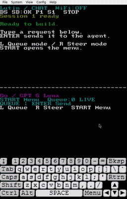
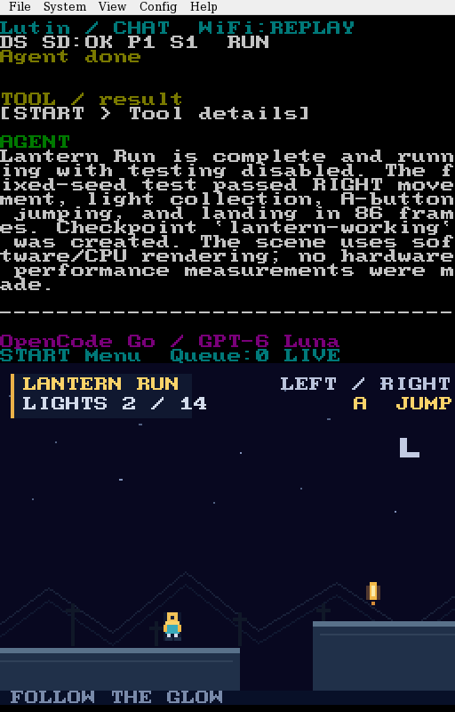
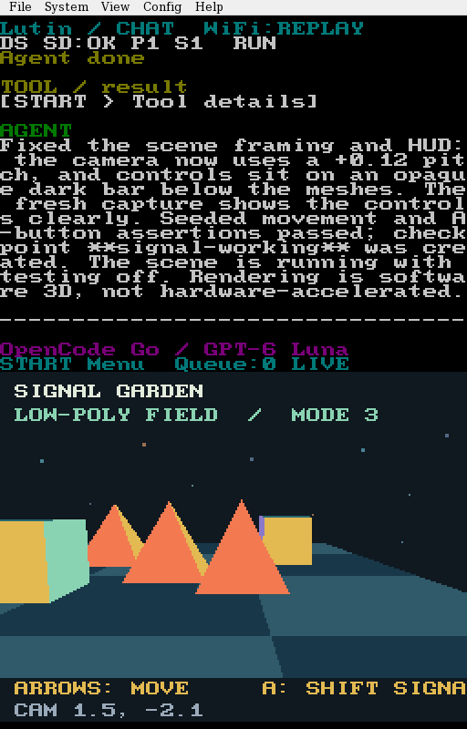
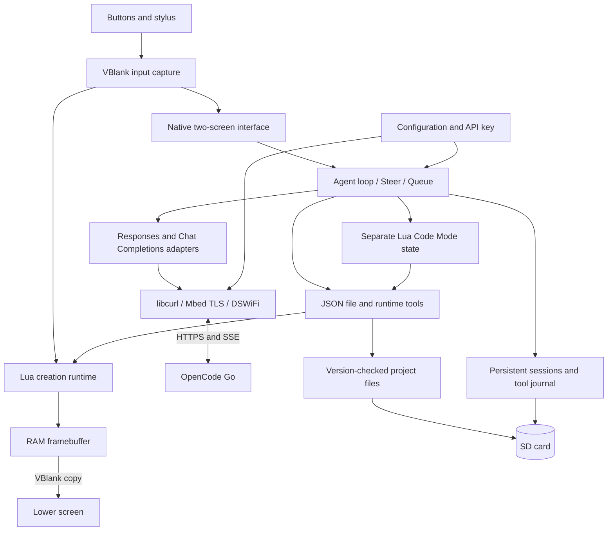

<div align="center">
  

# Lutin

**An AI coding agent for Nintendo DSi.**

[](https://github.com/sachahjkl/lutin/releases/latest)
[](https://github.com/sachahjkl/lutin/actions/workflows/ci.yml)
[](LICENSE)

[Website](https://sachahjkl.github.io/lutin/) · [Download](https://github.com/sachahjkl/lutin/releases/latest) · [Install](#installation) · [User guide](docs/usage.md) · [Contribute](CONTRIBUTING.md)

</div>

Lutin writes and runs Lua programs on the console, reads runtime errors, and edits the files in response to your requests.

[](docs/media/presentation.mp4)

**[Watch the presentation · MP4](docs/media/presentation.mp4)**
Recorded DeepSeek responses replayed in melonDS, with file and runtime tools executing in the ROM.

### Creation tests

[2D recording](https://github.com/sachahjkl/lutin/releases/download/v0.6.0/lutin-v0.6.0-2d-replay.mp4) · [Software 3D recording](https://github.com/sachahjkl/lutin/releases/download/v0.6.0/lutin-v0.6.0-3d-replay.mp4)

GPT 6 Luna generated both creations in live host sessions.
These emulator recordings replay their final validation calls, then exercise real emulated input.
See [verification evidence](docs/verification.md#creation-tool-sessions-2026-09-29).

 

[Install](#installation) · [Configure](#configuration) · [Controls](#controls) · [Architecture](#architecture) · [Contribute](CONTRIBUTING.md)

## Why a DSi?

The DSi already has a stylus, two screens, physical buttons, Wi-Fi, and an SD card.
Lutin uses that hardware for a coding agent: enter a request, run the resulting program, and ask for changes on the console.

The AI runs remotely through OpenCode Go. Your creations run locally in a bounded Lua sandbox.
Saved programs also work offline. Lutin supports games, animations, drawing tools, and other interactive programs.

## What it does

- **Autonomous tools:** read files, make version-checked edits, run programs, and inspect diagnostics.
- **Creation tests:** advance seeded frames with injected input and assert creation-defined state.
- **Visual feedback:** send PNG captures to image-capable models.
- **Checkpoints:** restore project source and assets after failed edits.
- **Two-screen workflow:** conversation above; keyboard, preview, or game controls below.
- **Persistent sessions:** create, switch, reset, and delete sessions stored on SD.
- **Steer and Queue:** redirect the current task or save requests for later.
- **Local execution:** draw shapes and text, read buttons and touch input, and inspect Lua errors.
- **Generated assets:** editable pixel sprites, animation frames, synthesized music, and sound effects. See [asset APIs](docs/assets.md).
- **Reusable APIs:** tilemaps, camera movement, animation, modules, save data, and bounded software 3D. See [creation tools](docs/creation-tools.md).
- **Input capture:** sample buttons at VBlank and retain short presses across a busy main-loop iteration.
- **Visible progress:** Wi-Fi state, transport stage, elapsed time, and received bytes.
- **Reproducible builds:** a pinned Nix environment, sanitizer tests, and emulator checks.

## Compatibility

Dynamic projects and generated assets are available from `v0.4.0`.

| Component  | Current support                                                                             |
| ---------- | ------------------------------------------------------------------------------------------- |
| Console    | Nintendo DSi / DSi XL in DSi mode. User-tested on DSi XL.                                   |
| Launcher   | Console SD card, Unlaunch, and TWiLight Menu++.                                             |
| Network    | DSi Wi-Fi through DSWiFi, including DSi-mode WPA2 support.                                  |
| AI service | OpenCode Go, with your own account and API key.                                             |
| Models     | GPT 6 Luna, GPT 5.6 Luna, Grok 4.6, DeepSeek V4 Flash. Availability depends on the service. |
| Build host | Linux x86-64 with Nix flakes enabled.                                                       |
| Emulator   | melonDS DS-mode UI and runtime checks. Full DSi emulation requires your own console dumps.  |
| Language   | English interface and documentation.                                                        |

## Installation

### 1. Prepare your console

If your console does not have a homebrew launcher, follow **[DSi CFW Guide](https://dsi.cfw.guide/)** first.
The [detailed installation guide](docs/install-dsi.md) explains the optional setup kit and its files.

Use a FAT32 SD card and launch Lutin in DSi mode from the console's SD slot.

### 2. Get the ROM and SD files

Download the SD ZIP from **[the latest release](https://github.com/sachahjkl/lutin/releases/latest)**.
Extract it on your computer. It contains the ROM, CA bundle, configuration example, and starter program.
For an existing TWiLight Menu++ setup, copy the `roms/` and `lutin/` files to the matching SD directories.
Keep existing configuration and project files when updating.

The standalone `.nds` download is sufficient for a ROM-only update.
Release assets include SHA-256 checksums.

To build the full installation kit from source, run this from the repository root:

```sh
nix build .#installation-kit -o result-installation
```

The source-built kit uses these paths:

| Build output                                     | SD destination                                             |
| ------------------------------------------------ | ---------------------------------------------------------- |
| `result-installation/02-menu/roms/nds/lutin.nds` | `/roms/nds/lutin.nds`                                      |
| `result-installation/02-menu/lutin/ca.pem`       | `/lutin/ca.pem`                                            |
| `result-installation/02-menu/lutin/config.json`  | `/lutin/config.json`                                       |
| `result-installation/02-menu/lutin/models.json`  | `/lutin/models.json`                                       |
| `result-installation/02-menu/lutin/projects/1/`  | `/lutin/projects/1/` — optional starter program and assets |

Do not overwrite an existing project with the starter animation.
For an update, replace the ROM. Update the CA bundle when needed.
When upgrading from `v0.4.0`, also install `models.json` for the new SD catalog.

### 3. Set up OpenCode Go

1. Create an account and API key through [OpenCode Go](https://opencode.ai/v2/docs/console/go/).
2. Save the key as plain text in `/lutin/keys/opencode-go` on the SD card.
3. Configure Wi-Fi in the DSi system settings.
4. Set the correct console date and time for HTTPS certificate validation.
5. Launch `/roms/nds/lutin.nds` from TWiLight Menu++ in DSi mode.

The key file contains only the key: no quotes, variable name, or `Bearer` prefix.
The application loads it from the SD card at runtime.
AI requests use your OpenCode Go allowance.

### 4. Make something

Try:

> Create a small platformer. Use LEFT and RIGHT to move and A to jump. Start with a playable version, run it, and fix errors.

Select **START → Play controls** to send buttons and touch input to the running program.
**Preview** displays the program without giving it your input.
To try Lutin offline first, select **START → Run program** for the starter animation.

## Configuration

Edit `/lutin/config.json`, then restart Lutin:

```json
{
  "default_model": "opencode-go/deepseek-v4-flash",
  "tool_details": false,
  "startup_view": "sessions"
}
```

| Key             | Values                                                               | Default                  |
| --------------- | -------------------------------------------------------------------- | ------------------------ |
| `default_model` | Provider-qualified model ID, such as `opencode-go/deepseek-v4-flash` | `opencode-go/gpt-6-luna` |
| `tool_details`  | `true` or `false`                                                    | `false`                  |
| `startup_view`  | `keyboard` or `sessions`                                             | `keyboard`               |

All keys are optional. A session's saved model takes priority over the default.
Unknown, repeated, or invalid keys reject the whole configuration and display a diagnostic.
Model IDs use `provider/model` in configuration and saved sessions.
The [SD model catalog](docs/model-catalog.md) supports manual entries, reloading, and updates from the START command menu.
Each provider reads its own credential file from `/lutin/keys/<provider-id>`.
The bundled provider is `opencode-go`, with the four models listed above.

## Controls

| Where            | Control               | Action                                          |
| ---------------- | --------------------- | ----------------------------------------------- |
| Anywhere         | START                 | Open or close the menu.                         |
| Menu             | Up/Down + A, or touch | Select an action.                               |
| Keyboard         | Enter                 | Send the draft.                                 |
| Outside gameplay | L / R                 | Select Queue / Steer.                           |
| Chat or preview  | Up/Down               | Scroll the conversation.                        |
| Sessions         | X                     | Create a session.                               |
| Sessions         | Up/Down + A           | Open the selected session.                      |
| Sessions         | Y / B                 | Reset / delete the current session, marked `*`. |
| Sessions         | Right / Left          | Next page / first page.                         |
| Queue            | A / X / Y / Left      | Resume / edit / move first / delete.            |

Resetting a session clears its conversation, Queue, and tool journal. Project files remain on SD.
**Stop agent** and **Stop program** are separate actions.
See the [user guide](docs/usage.md) for the full behavior and Lua API.

## Architecture



The native host owns input routing, networking, persistence, and display updates.
Creation Lua and Code Mode use separate states with separate memory budgets.
Tools run only after a complete model generation arrives. Completed tool calls are journaled to prevent automatic replay.

### Source map

| Files                                                   | Responsibility                                      |
| ------------------------------------------------------- | --------------------------------------------------- |
| `source/main.c`, `source/chat.c`                        | Screens, keyboard, menus, and conversation display. |
| `source/input.h`, `source/platform_input.h`             | Buffered input and hardware sampling.               |
| `source/agent.c`, `source/tools.c`                      | Sessions, autonomous turns, and tool execution.     |
| `source/network.c`, `source/protocol.c`, `source/sse.c` | Wi-Fi, HTTPS, API adapters, and streaming.          |
| `source/runtime.c`, `source/sandbox.h`                  | Lua callbacks, drawing, input, and budgets.         |
| `source/workspace.c`, `source/config.c`                 | SD storage and configuration.                       |

## Build and test

```sh
nix develop
make
prek run --all-files
nix flake check "path:$PWD" --no-write-lock-file
```

Or build only the ROM:

```sh
nix build .#rom -o result-rom
```

The result is `result-rom/lutin.nds`.
Automated checks do not require credentials. They cover storage failures, sandbox limits, input buffering, stream parsing, configuration, sessions, and emulator behavior.
See [verification evidence](docs/verification.md) and [contribution instructions](CONTRIBUTING.md).

## Current limits

- Creations use a 256 × 192 framebuffer, shapes, ASCII text, pixel sprites, and synthesized audio. See [asset APIs](docs/assets.md).
- Lua creation memory is limited to 2 MiB. Code Mode uses at most 512 KiB.
- Project text files are limited to 32 KiB. Serialized sessions are limited to 192 KiB.
- Projects and sessions are created on demand and listed in bounded pages.
- Input capture retains a short press, but it does not make long native operations preemptible.
- Repeated presses of the same button during one blocked iteration merge into one event.
- User testing confirms operation on a DSi XL. New input changes still need physical-console validation.

## License and credits

Lutin is licensed under **[MIT](LICENSE)**.
It builds on BlocksDS, libnds, DSWiFi, Lua, cJSON, libcurl, Mbed TLS, and the DS homebrew ecosystem.
See [third-party notices](THIRD_PARTY.md) for dependencies and separately distributed installation tools.
